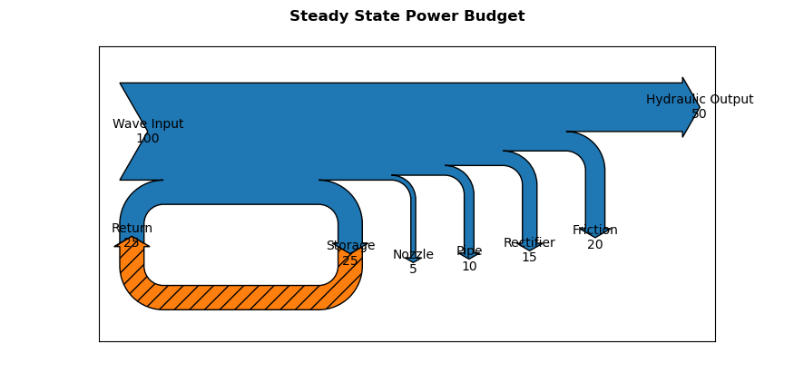

# Sankey - Steady-State Power Budget

Create simple Sankey diagrams for visualizing the steady-state power budget of a system. The diagram shows how input power is distributed among useful outputs, system losses, and optional internal energy-storage pathways.

The program reads the system definition from a JSON input file and automatically constructs the corresponding Sankey diagram using Matplotlib.

## Power Balance

For a steady-state system, the external power balance is

```math
\sum P_\mathrm{input}
=
\sum P_\mathrm{output}
+
\sum P_\mathrm{loss}.
```

The program checks this balance before generating the Sankey diagram. An invalid power budget will raise an error rather than produce a physically inconsistent diagram.

Multiple inputs, outputs, and losses may be defined.

## Example

The following example shows a steady-state power budget containing an
internal storage loop.

<p align="center">
  
</p>

## Input File

The system is defined using a JSON file containing a list of power flows. Each flow contains three fields:

- `name` - Descriptive name displayed on the Sankey diagram.
- `type` - Classification of the flow.
- `value` - Magnitude of the power flow.

The currently supported flow types are:

- `input` - Power entering the system from an external source.
- `output` - Useful power leaving the system.
- `loss` - Power dissipated or otherwise lost from the system.
- `storage` - Internal recirculating power associated with an energy-storage mechanism.

For example:

```json
{
    "title": "Power Budget Flow",
    "flows": [
        {
            "name": "Mechanical Input",
            "type": "input",
            "value": 100
        },
        {
            "name": "Hydraulic Output",
            "type": "output",
            "value": 50
        },
        {
            "name": "Compressibility",
            "type": "storage",
            "value": 25
        },
        {
            "name": "Nozzle",
            "type": "loss",
            "value": 5
        },
        {
            "name": "Pipe",
            "type": "loss",
            "value": 10
        },
        {
            "name": "Rectifier",
            "type": "loss",
            "value": 15
        },
        {
            "name": "Friction",
            "type": "loss",
            "value": 20
        }
    ]
}
```

For this example, the external steady-state power balance is

```math
100 = 50 + 5 + 10 + 15 + 20.
```

## Energy Storage

Storage is treated as an **internal recirculating power flow** rather than an additional external input or output. At steady state, the power entering storage is equal to the power returned from storage,

``` math
P_\mathrm{storage,in}
=
P_\mathrm{storage,out}
```

such that

``` math
\frac{dE_\mathrm{storage}}{dt}=0.
```

The storage flow therefore cancels from the external power balance. Its inclusion in the Sankey diagram represents power circulating through an energy-storage mechanism after the system has reached steady-state operation.

The diagram does **not** represent the transient process required to initially charge or fill the storage mechanism. During such a transient,

``` math
\frac{dE_\mathrm{storage}}{dt} \neq 0
```

and the instantaneous input and output power budget would differ from the steady-state representation.

Currently, one storage element is supported.

## Input Validation

The input data are validated before plotting. The program checks that:

- the JSON file contains a `flows` list;
- every flow contains `name`, `type`, and `value`;
- flow types are recognized;
- flow values are numeric and non-negative;
- at least one input and one output are provided;
- no more than one storage element is defined; and
- the external steady-state power budget balances.

## Usage

By default, the program reads the system definition from `input.json`:

```bash
python sankey.py
```

The Sankey diagram is then generated using the values and labels specified in the input file.
